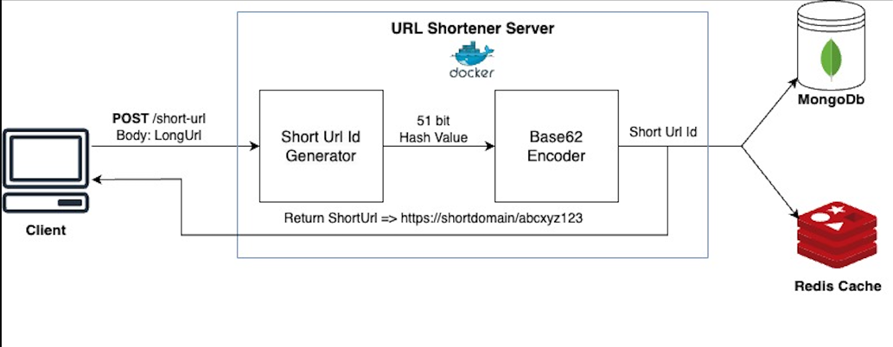

## URL Shortening Application
A high performance url-shortening application written in Java. It allows users to shorten long URLs into shorter, more manageable URLs.

### Architecture Diagram
#### Create Short Url


#### Redirect to Long Url


### Features
* Robust short url generation strategy. Supports up to 62^9 urls. More about the id generation strategy over [here](#Short Url Id Generation Strategy).  
* Shorten long URLs: Users can enter a long URL and the application will generate a unique, shortened URL.
* Redirect to original URL: When users visit a shortened URL, they will be redirected to the original long URL.

### Getting Started
* Clone the repository
```sh
git clone repo_url
```
* Navigate to the project directory:
```sh
cd url-shortener
```
* Update the MongoDB and redis connection settings in the application.properties file.
* Build the project
```sh
mvn clean install
```
* Run the application 
```sh
java -jar target/url-shortener.jar
```

### REST API
#### Request
`POST /short-url`
```sh
curl -X POST -H 'Content-Type: application/json' -d '{"longUrl": "A long url", "userId": "A user id"}'
```
#### Response
```sh
HTTP/1.1 200 OK
Date: Mon, 17 Jul 2023 18:13:00 IST
Status: 200 OK
Content-Type: application/json
Content-Length: 33

https://short.domain.com/abcxyz123
```

#### Request
`GET /{shortUrlId}`
```sh
curl https://short.domain.com/abcxyz123
```
#### Response
```sh
HTTP/1.1 200 OK
Date: Mon, 17 Jul 2023 18:17:00 IST
Status: 200 OK
Content-Type: application/json
Content-Length: 36

https://long.domain.com/veryLongPath
```

### Short Url Id Generation Strategy
The id generation strategy that has been implemented is based on Twitter's Snowflake approach.
A 51 bit number is generated and used as a hash function. The hash function is then base 62 encoded to generate a 9 character hash value/short url id.

|   Timestamp   | Data Center Id | Instance Id  | Sequence Number |
|:-------------:|:--------------:|:------------:|:---------------:|
| <--31 bits--> |  <--5 bits-->  | <--5 bits--> |  <--10 bits-->  |

* Timestamp - Epoch time in seconds
* Data Center Id - The data center id. Supports up to 32 data centers
* Instance Id - The instance id. Supports up to 32 instances of the application
* Sequence Number - A number ranging from 0 to 1023. Supports up to 1024 requests per second

### Contributors
Subramanya Keshavamurthy [keshavas@oregonstate.edu](mailto://keshavas@oregonstate.edu)